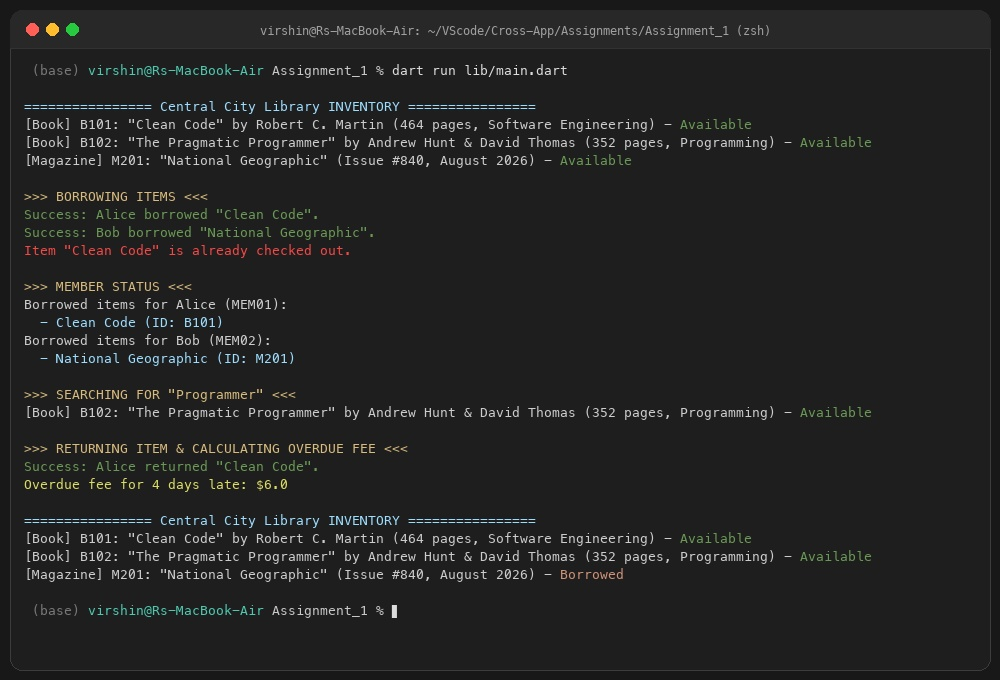

# 📚 Library Management System (Dart Console Assignment)

A modular, Object-Oriented Dart console application designed to simulate a community library system. This project demonstrates core Dart concepts including variables, data structures, control flow, functions, and OOP principles with inheritance.

---

## 🚀 Features

- **Object-Oriented Architecture**:
  - Abstract base class (`Item`) modeling common catalog properties.
  - Subclasses (`Book`, `Magazine`) inheriting from `Item` and overriding methods.
  - Entity classes (`Member`, `Library`) to manage patrons and catalog operations.
- **Inventory & Member Management**:
  - Add items (Books & Magazines) to the catalog.
  - Register library members.
  - Checkout/Borrow items with availability validation.
  - Return items and track member inventory.
- **Search & Utility**:
  - Search catalog items by keyword.
  - Calculate overdue late fees with custom rates.

---

## 📁 Project Structure

```
Assignment_1/
├── README.md               # Project overview and quickstart guide
├── DOCUMENTATION.md        # In-depth technical documentation & architecture breakdown
└── lib/
    ├── item.dart           # Abstract base class (Item)
    ├── book.dart           # Book class extending Item
    ├── magazine.dart       # Magazine class extending Item
    ├── member.dart         # Member entity managing borrowed items
    ├── library.dart        # Core service managing catalog, checkouts & returns
    ├── fee_calculator.dart # Utility function for late fee calculations
    ├── console.dart        # Library execution flow definition
    └── main.dart           # Main entry point
```

---

## 🛠️ Concepts Demonstrated

| Concept | Implementation Details |
| :--- | :--- |
| **Variables & Types** | `String`, `int`, `double`, `bool`, `List<Item>`, `Map<String, Member>` |
| **OOP & Inheritance** | `Item` (Base) → `Book`, `Magazine` (Derived with `extends`, `super`, `@override`) |
| **Encapsulation & Abstraction** | Abstract method `displayInfo()`, modular class separation |
| **Functions** | Named parameters (`required`), default parameters, return types |
| **Loops & Control Flow** | `for`, `for-in`, `while`, `if-else` condition checks |

---

## ▶️ Getting Started & Execution

### Prerequisites
Make sure you have the [Dart SDK](https://dart.dev/get-dart) installed.

### Running the Application

Navigate to the `Assignment_1` directory and run:

```bash
dart run lib/main.dart
```

*(Alternatively, you can also run via `dart run lib/console.dart`)*

---

## 🖥️ Sample Console Output



```text
================ Central City Library INVENTORY ================
[Book] B101: "Clean Code" by Robert C. Martin (464 pages, Software Engineering) - Available
[Book] B102: "The Pragmatic Programmer" by Andrew Hunt & David Thomas (352 pages, Programming) - Available
[Magazine] M201: "National Geographic" (Issue #840, August 2026) - Available

>>> BORROWING ITEMS <<<
Success: Alice borrowed "Clean Code".
Success: Bob borrowed "National Geographic".
Item "Clean Code" is already checked out.

>>> MEMBER STATUS <<<
Borrowed items for Alice (MEM01):
  - Clean Code (ID: B101)
Borrowed items for Bob (MEM02):
  - National Geographic (ID: M201)

>>> SEARCHING FOR "Programmer" <<<
[Book] B102: "The Pragmatic Programmer" by Andrew Hunt & David Thomas (352 pages, Programming) - Available

>>> RETURNING ITEM & CALCULATING OVERDUE FEE <<<
Success: Alice returned "Clean Code".
Overdue fee for 4 days late: $6.0

================ Central City Library INVENTORY ================
[Book] B101: "Clean Code" by Robert C. Martin (464 pages, Software Engineering) - Available
[Book] B102: "The Pragmatic Programmer" by Andrew Hunt & David Thomas (352 pages, Programming) - Available
[Magazine] M201: "National Geographic" (Issue #840, August 2026) - Borrowed
```
