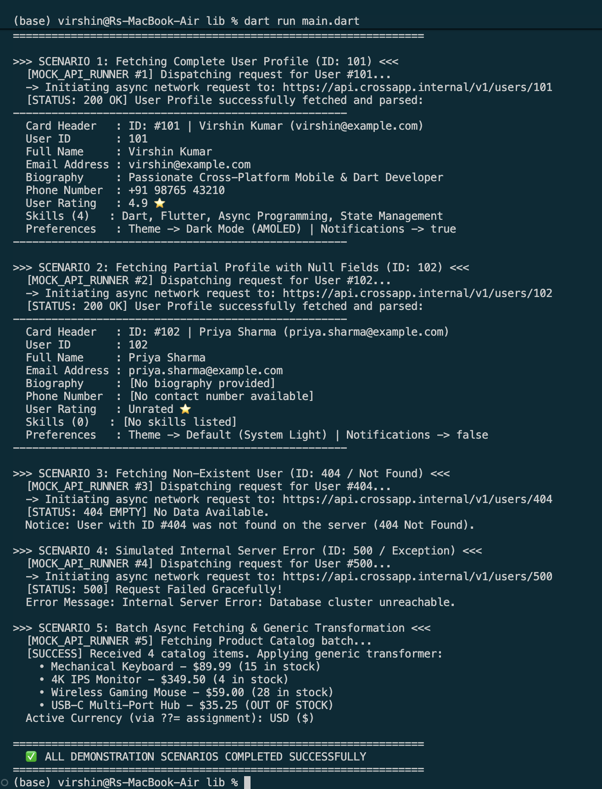

# 🌐 Async & Null Safety Mock API System (Dart Assignment 2)

A modular, production-ready Dart console application demonstrating asynchronous programming (`Future`, `async/await`), sound Null Safety (`Type?`, `??`, `??=`, `?.`, `!`, `late final`, and type promotion), and defensive error handling (`Never`, `ApiException`, `try-catch`, sealed classes).

---

## 🚀 Key Highlights & Architecture

- **Asynchronous Architecture (`Future` & `async/await`)**:
  - Simulates non-blocking asynchronous REST API operations using `Future.delayed()`.
  - Realistic latency and lifecycle handling across client, service, and data layers.
- **Defensive Null Safety**:
  - Resilient deserialization of raw JSON / Map payloads containing missing keys or explicit `null` fields.
  - Safe fallbacks via the null-coalescing operator (`??`) and null-coalescing assignment (`??=`).
  - Safe conditional navigation with `?.` and safe bang (`!`) unwrapping on promoted fields.
  - Immutable lazy computation using `late final`.
- **Exhaustive State Representation**:
  - Sealed class hierarchy (`ApiResult<T>`: `ApiSuccess`, `ApiError`, `ApiEmpty`).
  - Dart 3 Pattern Matching `switch` expressions for exhaustive, compile-time guaranteed state handling.
  - Custom `ApiException` and `Never` return type helper for throwing validation exceptions.
- **Functional Programming & Generics**:
  - Generic transformer `applyTransform<T, R>` to process batch collections without code duplication.
  - Higher-order functions and state-capturing closures for sequential activity logging.

---

## 📁 Project Structure

```
Assignment_2/
├── README.md                 # Project overview, concept mapping & execution guide
├── DOCUMENTATION.md          # Comprehensive multi-page architectural documentation
├── DOCUMENTATION.docx        # Formatted Word Document technical report
├── assets/
│   └── terminal_output.png   # Terminal execution output screenshot
└── lib/
    ├── user_profile.dart     # Entity model with nullable fields, late final & safe parsing
    ├── api_result.dart       # Sealed class hierarchy (Success, Error, Empty)
    ├── mock_api_service.dart # Async network service simulating delay, 200/404/500
    ├── error_handler.dart    # Custom ApiException and Never return type helpers
    ├── data_transformer.dart # Generic transformers & stateful logging closures
    ├── controller.dart       # Orchestrates and showcases all 5 demonstration scenarios
    └── main.dart             # Main executable entry point
```

---

## 🛠️ Concepts Demonstrated (from `dart_basics-main`)

| Concept | File Reference in `dart_basics-main` | Implementation in Assignment 2 |
| :--- | :--- | :--- |
| **Async / Future / Await** | Core Dart Async standard | `Future.delayed()`, `async/await` in `MockApiService` and `ApiDemoController` |
| **Null Safety Basics** | `6_null_safety.dart` | `String?`, `int?`, `??` fallback defaults, `??=` assignment, `?.` safe access, `!` bang operator |
| **Advanced Null Safety** | `9_advanced_null_safety.dart` | `late final` lazy fields, `Never` return type, `try-catch` exception handling |
| **Advanced Control Flow** | `7_advanced_control_flow.dart` | `sealed class ApiResult<T>` with pattern matching `switch` cases & record destructuring |
| **Advanced Functions** | `8_advanced_functions.dart` | Generic transformer `applyTransform<T, R>`, state closures, named parameters |
| **Variables & Collections**| `1_variables.dart`, `2_collections.dart` | `Map<String, dynamic>`, `List<String>`, `int.parse()`, `toStringAsFixed()` |

---

## 🧪 Demonstration Scenarios

1. **Scenario 1: Complete User Profile (200 OK)**
   - Fetches full profile asynchronously (User ID #101).
   - Validates all fields, tests `late final` card generation, and prints complete profile.
2. **Scenario 2: Partial Profile with Null Fields (200 OK + Null Coalescing)**
   - Fetches profile containing missing/null values (User ID #102).
   - Triggers `??` fallback strings, `skills?.length ?? 0`, and nested `preferences` map navigation without throwing errors.
3. **Scenario 3: Resource Not Found / Null Payload (404 Empty)**
   - Simulates querying a non-existent record (User ID #404).
   - Returns `null` from service; handled cleanly via `ApiEmpty` without application crashes.
4. **Scenario 4: Simulated Internal Server Error (500 Exception)**
   - Simulates database failure (User ID #500).
   - Throws `ApiException`, caught via `try-catch`, wrapped into `ApiError`, and displayed gracefully.
5. **Scenario 5: Batch Async Fetching & Generic Transformation**
   - Fetches product catalog list asynchronously.
   - Transforms items using `applyTransform<Map<String, dynamic>, String>` and demonstrates `??=` on currency strings.

---

## ▶️ Getting Started & Execution

### Prerequisites
Ensure the [Dart SDK](https://dart.dev/get-dart) (version 3.0 or later) is installed on your system.

### Running the Application

Navigate to the `Assignment_2` directory and execute:

```bash
cd Assignment_2
dart run lib/main.dart
```

*(Alternatively, you can navigate into `lib` and run `dart run main.dart`)*

### Static Analysis & Verification

To verify code quality and null-safety compliance:

```bash
dart analyze
```

---

## 🖥️ Terminal Execution Output

```text
================================================================
  🚀 DART ASYNC, FUTURE & NULL SAFETY DEMO (ASSIGNMENT 2)
================================================================

>>> SCENARIO 1: Fetching Complete User Profile (ID: 101) <<<
  [MOCK_API_RUNNER #1] Dispatching request for User #101...
  -> Initiating async network request to: https://api.crossapp.internal/v1/users/101
  [STATUS: 200 OK] User Profile successfully fetched and parsed:
----------------------------------------------------
  Card Header   : ID: #101 | Virshin Kumar (virshin@example.com)
  User ID       : 101
  Full Name     : Virshin Kumar
  Email Address : virshin@example.com
  Biography     : Passionate Cross-Platform Mobile & Dart Developer
  Phone Number  : +91 98765 43210
  User Rating   : 4.9 ⭐
  Skills (4)   : Dart, Flutter, Async Programming, State Management
  Preferences   : Theme -> Dark Mode (AMOLED) | Notifications -> true
----------------------------------------------------

>>> SCENARIO 2: Fetching Partial Profile with Null Fields (ID: 102) <<<
  [MOCK_API_RUNNER #2] Dispatching request for User #102...
  -> Initiating async network request to: https://api.crossapp.internal/v1/users/102
  [STATUS: 200 OK] User Profile successfully fetched and parsed:
----------------------------------------------------
  Card Header   : ID: #102 | Priya Sharma (priya.sharma@example.com)
  User ID       : 102
  Full Name     : Priya Sharma
  Email Address : priya.sharma@example.com
  Biography     : [No biography provided]
  Phone Number  : [No contact number available]
  User Rating   : Unrated ⭐
  Skills (0)   : [No skills listed]
  Preferences   : Theme -> Default (System Light) | Notifications -> false
----------------------------------------------------

>>> SCENARIO 3: Fetching Non-Existent User (ID: 404 / Not Found) <<<
  [MOCK_API_RUNNER #3] Dispatching request for User #404...
  -> Initiating async network request to: https://api.crossapp.internal/v1/users/404
  [STATUS: 404 EMPTY] No Data Available.
  Notice: User with ID #404 was not found on the server (404 Not Found).

>>> SCENARIO 4: Simulated Internal Server Error (ID: 500 / Exception) <<<
  [MOCK_API_RUNNER #4] Dispatching request for User #500...
  -> Initiating async network request to: https://api.crossapp.internal/v1/users/500
  [STATUS: 500] Request Failed Gracefully!
  Error Message: Internal Server Error: Database cluster unreachable.

>>> SCENARIO 5: Batch Async Fetching & Generic Transformation <<<
  [MOCK_API_RUNNER #5] Fetching Product Catalog batch...
  [SUCCESS] Received 4 catalog items. Applying generic transformer:
    • Mechanical Keyboard - $89.99 (15 in stock)
    • 4K IPS Monitor - $349.50 (4 in stock)
    • Wireless Gaming Mouse - $59.00 (28 in stock)
    • USB-C Multi-Port Hub - $35.25 (OUT OF STOCK)
  Active Currency (via ??= assignment): USD ($)

================================================================
  ✅ ALL DEMONSTRATION SCENARIOS COMPLETED SUCCESSFULLY
================================================================
```

---

## 📷 Visual Output Screenshot


