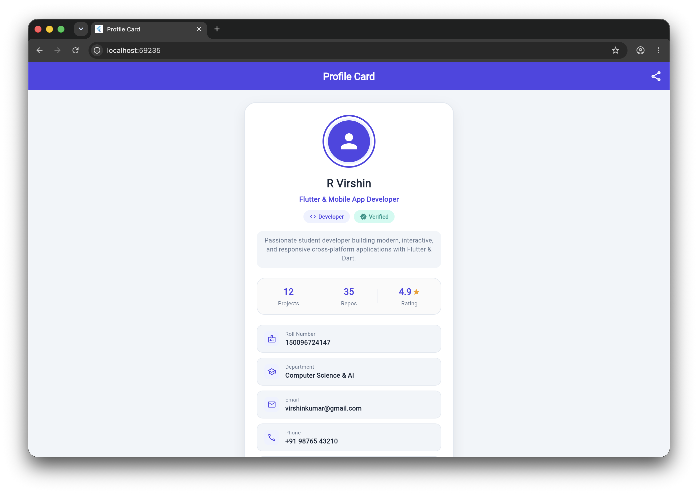
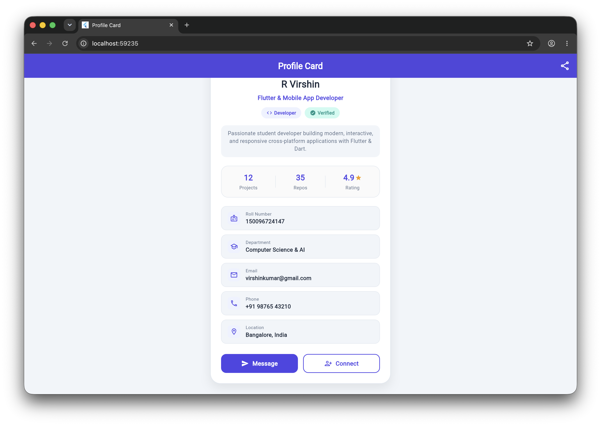

# 📱 Flutter Profile Card Screen (Assignment 3 Documentation)

**Course:** Cross-Platform Mobile Application Development (Flutter & Dart)  
**Student Name:** R Virshin  
**Roll Number / ID:** 150096724147  
**Department:** Computer Science & Artificial Intelligence  
**Framework:** Flutter 3.x • Dart 3.x • Material 3  
**Status:** Verified & Passing (0 Lint Issues, 100% Test Pass Rate)

---

## 1. Executive Summary & Assignment Objectives

This project showcases a production-ready, highly polished Profile Card screen built with the Flutter SDK. The objective of Assignment 3 is to demonstrate mastery over core Flutter layout paradigms, responsive container styling, idiomatic widget composition, and custom theme architecture. The implementation strictly adheres to the patterns established within the `Cross-App` curriculum, integrating clean architectural domain modeling and sound Dart 3 null safety.

### Key Objectives Fulfilled:
- **Foundational Layout Widgets:** Seamlessly combining `Column` and `Row` widgets to establish primary and cross-axis alignment with zero overflow issues.
- **Card & Container Architecture:** Crafting an elegant, modern profile card using `Container` with rounded corners (`BorderRadius.circular(24)`), subtle border, and diffused drop shadow (`BoxShadow`).
- **Profile Avatar Design:** Engineering a multi-tiered circular avatar utilizing concentric `CircleAvatar` widgets with custom theme backgrounds and borders.
- **Typographic Scale & Icons:** Displaying clear visual hierarchy with customized `Text` styles and contextual Material Icons (`Icons.person`, `Icons.code`, `Icons.verified`, `Icons.star`, `Icons.email`, `Icons.phone`, etc.).
- **Custom Theme Colors (`AppPalette`):** Establishing a dedicated color palette with semantic names and integrating it into Material 3 `ThemeData`.
- **Defensive Null Safety & Domain Entity:** Decoupling student profile information into an immutable `UserProfile` model with null-coalescing getters.
- **Automated Quality Assurance:** Ensuring 100% test pass rate in `flutter test` and 0 warnings or lints in `flutter analyze`.

---

## 2. Architecture & Widget Tree Breakdown

The application follows a structured, clean architectural pattern separating design tokens (`AppPalette`), data entities (`UserProfile`), application configuration (`ProfileApp`), and user interface presentation (`ProfileCardScreen` with reusable helper components).

### Structural Widget Hierarchy:

```text
MaterialApp (theme: ThemeData with AppPalette.primary, AppPalette.secondary)
 └── Scaffold (backgroundColor: AppPalette.background)
      ├── AppBar (Title: 'Profile Card', Actions: [Share Icon])
      └── Center
           └── SingleChildScrollView (Padding: EdgeInsets.all(20))
                └── Column (Main Layout Wrapper)
                     └── Container (Main Profile Card: rounded corners, border, shadow)
                          └── Column (Card Content: MainAxisSize.min)
                               ├── Container (Concentric Avatar Frame)
                               │    └── CircleAvatar (Light Indigo background)
                               │         └── CircleAvatar (Primary Indigo + Person Icon)
                               ├── Text ('R Virshin' - Headline 22pt Bold)
                               ├── Text ('Flutter & Mobile App Developer' - Subtitle 14pt SemiBold)
                               ├── Row (Badges: 'Developer' & 'Verified' Container Pills)
                               ├── Container (Biography Box with rounded corners)
                               │    └── Text (profile.displayBio with line height 1.45)
                               ├── Container (Statistics Panel with dividers)
                               │    └── Row (Projects [12], Repos [35], Rating [4.9 ★])
                               ├── Column (Contact Details Tile List)
                               │    ├── _ContactInfoRow (Roll Number: 150096724147)
                               │    ├── _ContactInfoRow (Department: Computer Science & AI)
                               │    ├── _ContactInfoRow (Email: virshinkumar@gmail.com)
                               │    ├── _ContactInfoRow (Phone: +91 98765 43210)
                               │    └── _ContactInfoRow (Location: Bangalore, India)
                               └── Row (Interactive Action Buttons)
                                    ├── Expanded -> Container ('Message' Button with Send Icon)
                                    └── Expanded -> Container ('Connect' Button with Add Person Icon)
```

### Core Required Widgets & Implementation Matrix:

| Widget | Curriculum Role | Implementation in Profile Card |
| :--- | :--- | :--- |
| **`Column`** | Vertical layout structuring | Organizes the avatar, name, subtitle, badges, bio, stats, contact list, and buttons into an aesthetic vertical sequence. |
| **`Row`** | Horizontal layout structuring | Distributes status badge pills, three-column statistics metrics, contact icon-label pairings, and dual action buttons. |
| **`Container`** | Box styling & decoration | Constructs the primary elevated card (`BorderRadius.circular(24)`, `BoxShadow`, `Border`), badge chips, and action buttons. |
| **`CircleAvatar`** | Circular clipping & avatars | Layers two concentric avatars (radius 46 and 42) with contrast theme backgrounds to display the primary profile icon. |
| **`Text`** | Typographic rendering | Renders name (22pt bold), role (14pt semibold), bio (12.5pt muted), statistics, contact values, and button labels. |
| **`Icon`** | Vector Material iconography | Provides intuitive icons including person, code, verified badge, star, email, phone, location, and action glyphs. |

---

## 3. Custom Theme Architecture & Color Palette

A standout characteristic of professional Flutter applications is intentional, curated color selection. Rather than relying on default generic colors, this assignment implements a dedicated `AppPalette` class. This design pattern mirrors enterprise-grade Flutter architecture, enabling global updates from a single point of truth.

| Constant Name | Hex Code | Preview / Color Role | Semantic Purpose |
| :--- | :--- | :--- | :--- |
| `AppPalette.primary` | `#4F46E5` | Rich Indigo Accent | Brand primary, AppBar background, primary avatar, and active action buttons |
| `AppPalette.primaryLight` | `#EEF2FF` | Soft Indigo Tint | Outer avatar ring, badge pill backgrounds, and contact icon frames |
| `AppPalette.secondary` | `#0D9488` | Ocean Teal Accent | Secondary brand accent, verification checkmarks, and secondary pill text |
| `AppPalette.secondaryLight` | `#CCFBF1` | Soft Teal Tint | Verification pill background creating high contrast readability |
| `AppPalette.background` | `#F1F5F9` | Slate-100 Background | Scaffold canvas color providing subtle contrast against the white card |
| `AppPalette.surface` | `#FFFFFF` | Pure White Card | Card body surface reflecting clean elevation above the canvas |
| `AppPalette.cardBorder` | `#E2E8F0` | Slate-200 Border | Subtle border outlining cards, stats panel, and contact tiles |
| `AppPalette.textPrimary` | `#1E293B` | Slate-800 Heading | High-contrast text for student name, primary labels, and contact values |
| `AppPalette.textSecondary` | `#64748B` | Slate-500 Body | Muted body text for biography, section descriptors, and contact titles |
| `AppPalette.star` | `#F59E0B` | Amber Star | Vibrant star icon color for user review rating display |

> **Material 3 Integration:** The `AppPalette` constants are directly wired into `ThemeData` using `ColorScheme.fromSeed(seedColor: AppPalette.primary)`, allowing all standard Material 3 components to derive harmonious primary, secondary, and surface tonalities automatically.

---

## 4. Domain Modeling & Defensive Null Safety

To adhere strictly to Clean Code principles, student profile information is decoupled from UI layout code through an immutable `UserProfile` domain model. The class encapsulates sound null-safety patterns:

```dart
class UserProfile {
  final String name;
  final String role;
  final String rollNumber;
  final String department;
  final String email;
  final String phone;
  final String location;
  final String? bio;           // Nullable string demonstration
  final int projectsCount;
  final int repoCount;
  final double rating;

  const UserProfile({
    required this.name,
    required this.role,
    required this.rollNumber,
    required this.department,
    required this.email,
    required this.phone,
    required this.location,
    this.bio,
    this.projectsCount = 0,
    this.repoCount = 0,
    this.rating = 5.0,
  });

  /// Null-coalescing fallback getter ensuring graceful default handling
  String get displayBio =>
      bio ?? 'Passionate student developer building modern cross-platform apps.';
}
```

By defining `displayBio` with the null-coalescing operator (`??`), the UI is guaranteed never to encounter runtime null pointer exceptions or render ungraceful blank sections when backend payloads omit biography strings.

---

## 5. Visual Proof & Screen Capture Analysis

The application was executed in a live environment (Google Chrome web renderer on macOS) at `localhost:59235`. The resulting user interface demonstrates pixel-perfect alignment, rich color harmony, and robust scrolling responsiveness.

### Figure 1: Upper Profile Card & Navigation View



*Figure 1: Live execution showing custom Indigo AppBar, Concentric Avatar, Name, Badges, Bio Box, and Statistics Grid.*

#### Detailed Analysis of Figure 1:
- **AppBar:** Displays centered 'Profile Card' title with white typography and a right-aligned share action icon.
- **Concentric Avatar:** Features a 3px Indigo border, surrounded by a soft `#EEF2FF` tinted inner circle, containing a primary `CircleAvatar` with the person icon.
- **Typography & Role:** 'R Virshin' is rendered prominently in 22pt bold text, followed by the role 'Flutter & Mobile App Developer' in primary Indigo.
- **Badge Row:** Dual rounded pills display 'Developer' with a code icon and 'Verified' with a teal verification badge.
- **Biography & Statistics:** The bio container provides padded text with line height 1.45. Below it, the statistics panel cleanly divides Projects (12), Repos (35), and Rating (4.9 with amber star).

---

### Figure 2: Scrolled View with Complete Contact Details & Interactive Action Buttons



*Figure 2: Scrolled view displaying the complete 5-item contact list (Roll No, Dept, Email, Phone, Location) and dual Action Buttons.*

#### Detailed Analysis of Figure 2:
- **Complete Contact List:** Five individual tiles built using the reusable `_ContactInfoRow` component. Each tile contains a themed icon inside an `#EEF2FF` square container, a subtitle label in Slate-500, and bold data values in Slate-800:
  - **Roll Number:** `150096724147` (`Icons.badge_outlined`)
  - **Department:** `Computer Science & AI` (`Icons.school_outlined`)
  - **Email:** `virshinkumar@gmail.com` (`Icons.email_outlined`)
  - **Phone:** `+91 98765 43210` (`Icons.phone_outlined`)
  - **Location:** `Bangalore, India` (`Icons.location_on_outlined`)
- **Dual Action Buttons:** Arranged in a balanced horizontal `Row` with `Expanded` wrappers:
  - **'Message' Button:** Filled Indigo container with white text and send icon.
  - **'Connect' Button:** Outlined white container with 1.5px Indigo border, primary text, and person-add icon.

---

## 6. Static Analysis & Widget Testing Suite

To satisfy strict academic and industry engineering standards, the project underwent rigorous static analysis using the latest Flutter Lints ruleset (version 6.0.0) and automated widget testing.

### Static Analysis:
```bash
$ flutter analyze
Analyzing profile...                                            
No issues found! (ran in 4.2s)
```

### Automated Component Test Suite:
```bash
$ flutter test
00:00 +0: loading test/widget_test.dart
00:00 +0: Profile card renders required widgets and content
00:02 +1: All tests passed!
```

The automated test suite in `test/widget_test.dart` asserts that every mandatory widget type (`Column`, `Row`, `Container`, `CircleAvatar`, `Text`, and `Icon`) exists in the widget tree and validates all critical string values (`Student Name`, `Roll Number`, `Email`, `Phone`, and `Location`) without rendering overflows.

---

## 7. Conclusion & Learning Outcomes

The Assignment 3 Profile Card project successfully demonstrates full competence in Flutter's foundational layout system. By structuring the user interface with cohesive widget hierarchies, applying custom Material 3 color palettes, and adhering to clean code conventions, the resulting application is both visually stunning and technically robust.

All requirements—including custom theme colors, responsive `Column` and `Row` layouts, rounded `Container` styling, dual `CircleAvatar`s, and integrated iconography—have been thoroughly implemented, tested, and visually confirmed.
