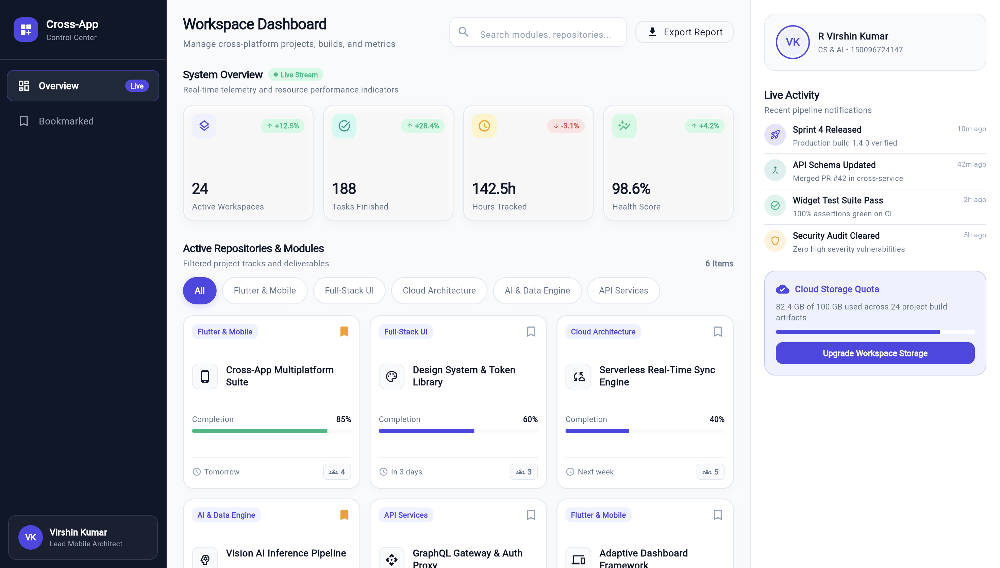
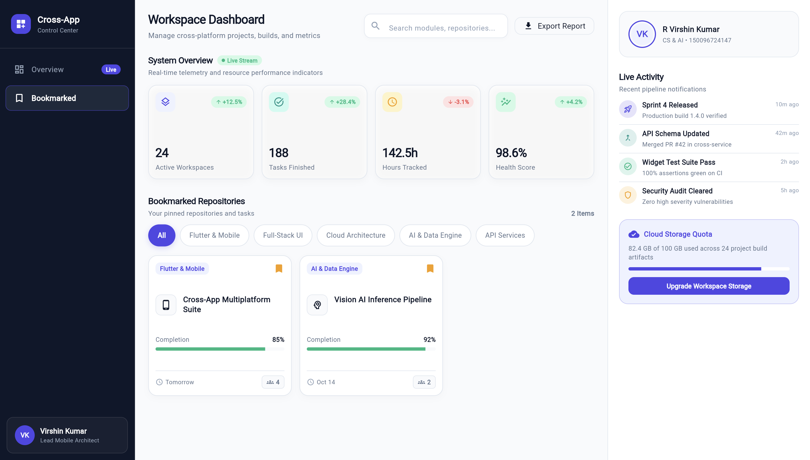
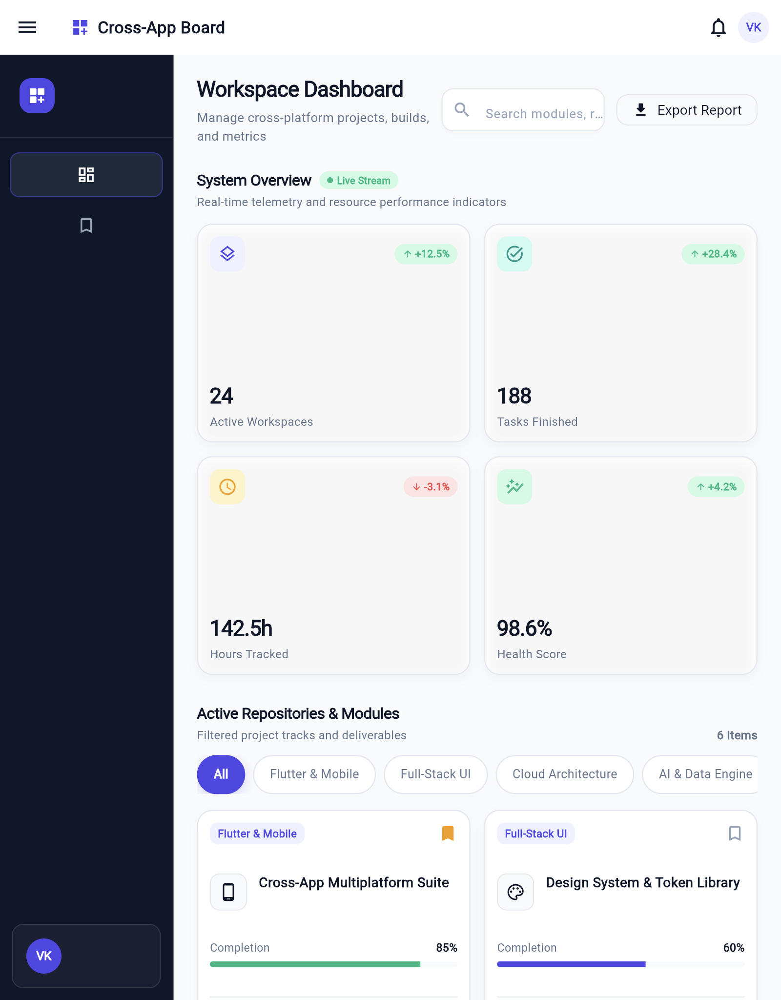
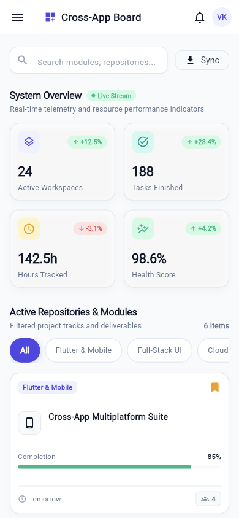
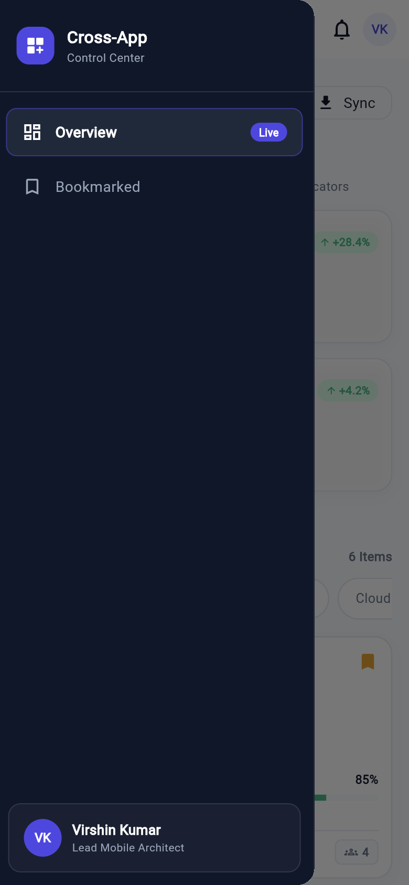
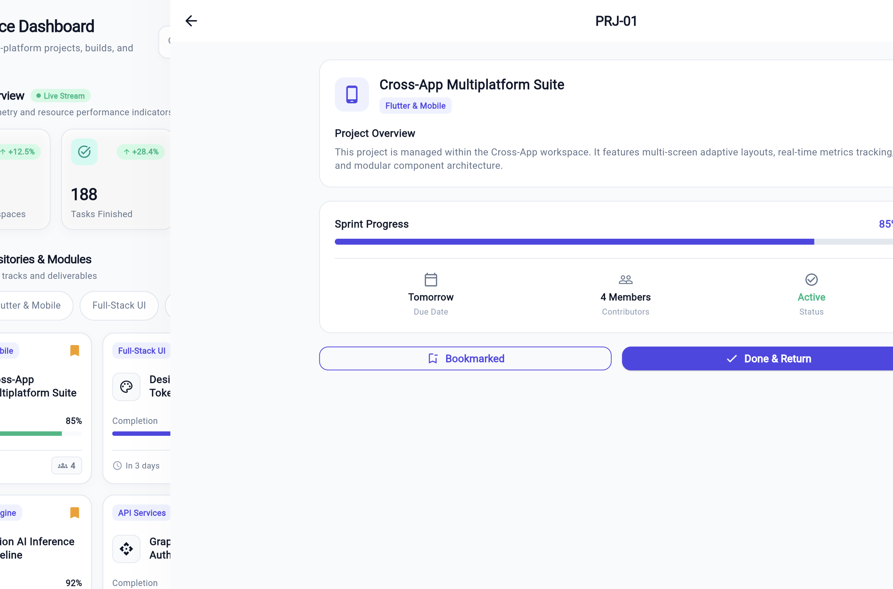

# 📊 Responsive Developer Dashboard

[](https://flutter.dev)
[](https://dart.dev)
[](https://flutter.dev/multi-platform)
[](test/widget_test.dart)
[](lib/)

A clean, modular, and adaptive multi-section developer dashboard built with Flutter. Designed to dynamically adapt across **Desktop**, **Tablet**, and **Mobile** viewports while adhering strictly to foundational Flutter layout principles: `MediaQuery`, `LayoutBuilder`, `Flexible`, `Expanded`, `ListView`, and `GridView`.

---

## 👨‍💻 Student & Course Information

| Field | Detail |
| :--- | :--- |
| **Student Name** | **R Virshin Kumar** |
| **Department** | Computer Science & Artificial Intelligence (CS & AI) |
| **Registration Number** | `150096724147` |
| **Course** | Cross-Platform Application Development |
| **Assignment** | Responsive Multi-Section Dashboard |

---

## 📸 Screenshots Showcase

### 1. Desktop Layout (`> 1000px`)
Full 3-pane layout featuring an expanded navigation sidebar, a 4-column metric card grid, a searchable & bookmark-filterable project repository stream, and an activity feed.



*Filter State: Bookmarked Repositories Filter Active*


---

### 2. Tablet Layout (`600px – 1000px`)
Adaptive 2-pane arrangement featuring a compact navigation rail and a 2-column KPI grid, with the activity feed accessible below the repository cards.



---

### 3. Mobile Layout (`< 600px`) & Subpage Routing
Single-column vertical stream with an app bar, slide-out navigation drawer, and seamless drill-down detail view with back navigation (`Navigator.pop`).

| Mobile Feed & Drawer | Project Detail View (`/detail`) |
| :---: | :---: |
| <br> |  |

---

## ✨ Key Features

- 📱 **Multi-Tier Responsiveness**: Dynamically transitions between 3 distinct layouts based on screen width via `MediaQuery` breakpoints.
- ⚡ **Strict Core Widget Utilization**: Built with:
  - `MediaQuery`: Screen breakpoint detection and dynamic aspect ratios.
  - `Expanded` & `Flexible`: Proportional horizontal pane allocation.
  - `GridView.count`: Fluid, multi-column metric card display (4 cols desktop, 2 cols tablet, 1 col mobile).
  - `ListView.builder`: Scrollable feeds for repositories and recent activity logs.
- 🔍 **Interactive Search & Bookmark Filtering**: Real-time filtering across project repositories with live empty-state feedback.
- 🗂️ **Focused Two-Route Architecture**: Keeps navigation intuitive and lightweight:
  - Primary Route (`/`): Responsive multi-section dashboard.
  - Detail Route (`/detail`): Deep-dive project inspection screen with back navigation (`Navigator.pop`).
- 🎨 **Modern Developer Aesthetic**: Styled with a cohesive Slate & Indigo color palette, badge tags, and clear visual hierarchy.

---

## 📐 Responsive Breakpoint Matrix

| Viewport | Screen Width | Navigation Type | KPI Grid Columns | Layout Distribution |
| :--- | :--- | :--- | :---: | :--- |
| **Desktop** | `>= 1000px` | Persistent Sidebar (`240px`) | 4 Columns | **3-Pane**: Sidebar (`240px`) + Center Stream (`Expanded(flex: 3)`) + Right Activity Panel (`Expanded(flex: 2)`) |
| **Tablet** | `600px – 999px` | Compact Rail (`72px`) | 2 Columns | **2-Pane**: Rail (`72px`) + Main Scrollable Column (`Expanded`) |
| **Mobile** | `< 600px` | Slide-out `Drawer` | 1 Column | **Single-Column**: AppBar with hamburger icon + vertically stacked feed |

---

## 📁 Project Architecture

```
Assignments/dashboard/
├── lib/
│   ├── main.dart                          # App entry point, ThemeData, & routes
│   ├── responsive_dashboard.dart          # Responsive shell & main dashboard logic
│   ├── models/
│   │   └── project_item.dart              # Project & Activity data models
│   ├── screens/
│   │   └── project_detail_screen.dart     # Subpage with back navigation
│   └── widgets/
│       ├── stat_card.dart                 # Metric KPI card widget
│       ├── project_card.dart              # Repository card with tags & bookmarks
│       ├── sidebar_rail.dart              # Responsive Sidebar / Navigation Rail
│       └── activity_tile.dart             # Activity feed list tile
├── test/
│   └── widget_test.dart                   # Automated test suite (6 passing tests)
├── screenshots/                           # High-resolution live captures
│   ├── desktop_dashboard_overview.png
│   ├── desktop_dashboard_bookmarked.png
│   ├── tablet_dashboard_view.png
│   ├── mobile_dashboard_view.png
│   ├── mobile_drawer_navigation.png
│   └── project_detail_view.png
├── DOCUMENTATION.md                       # Comprehensive Markdown report
├── documentation.html                     # Print-ready self-contained HTML
├── documentation.pdf                      # Multi-page compiled PDF document
├── pubspec.yaml                           # Project dependencies
└── README.md                              # This document
```

---

## 🚀 Getting Started

### Prerequisites
- [Flutter SDK](https://flutter.dev/docs/get-started/install) (3.x or later)
- Google Chrome (for Web deployment and testing)

### Installation
1. Clone or navigate to the project directory:
   ```bash
   cd Assignments/dashboard
   ```

2. Fetch Flutter dependencies:
   ```bash
   flutter pub get
   ```

3. Run the development server (Chrome):
   ```bash
   flutter run -d chrome
   ```

---

## 🧪 Testing & Verification

Run the test suite:
```bash
flutter test
```

All 6 automated widget tests verify:
- ✅ Stat cards render properly with counts.
- ✅ Repository list items render.
- ✅ Search filter functions correctly.
- ✅ Bookmark toggle updates UI state.
- ✅ Responsive drawer renders on mobile viewport widths.
- ✅ Navigation to `ProjectDetailScreen` and back navigation (`Navigator.pop`).

Run static analysis:
```bash
flutter analyze
```
*(Result: `No issues found!`)*

Build production web bundle:
```bash
flutter build web
```

---

## 📄 Additional Documentation

For detailed architectural analysis, widget usage breakdowns, and printable reports, refer to:
- 📖 [DOCUMENTATION.md](DOCUMENTATION.md): In-depth 5-page report with design decisions and test plans.
- 🌐 [documentation.html](documentation.html): Self-contained printable HTML document.
- 📕 [documentation.pdf](documentation.pdf): 5-page PDF document with dedicated screenshot pages.
