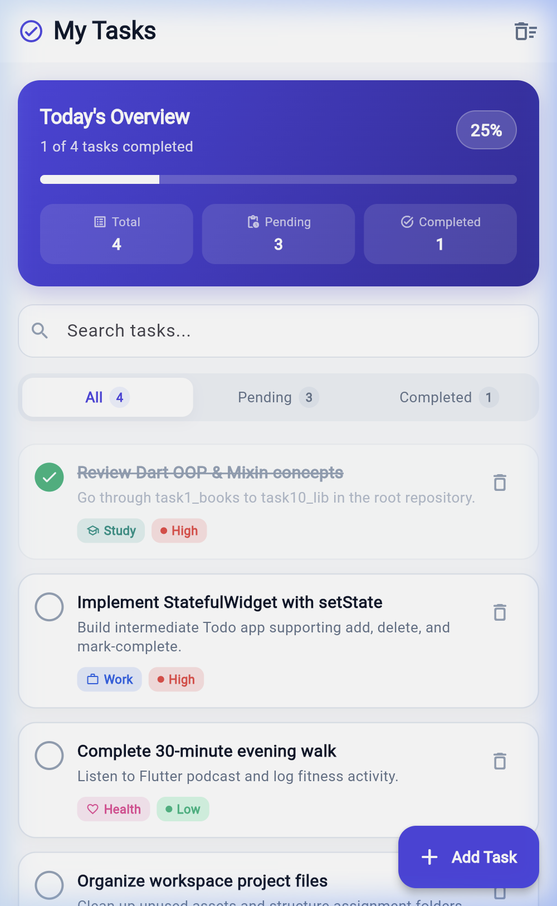
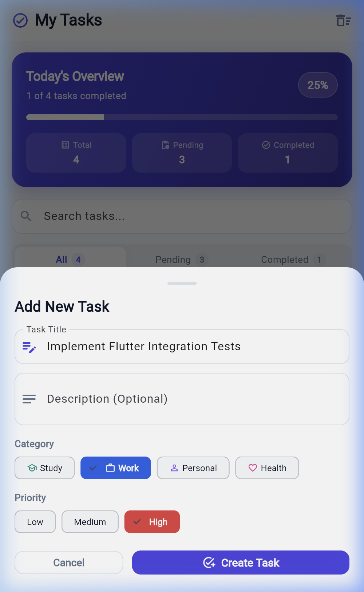
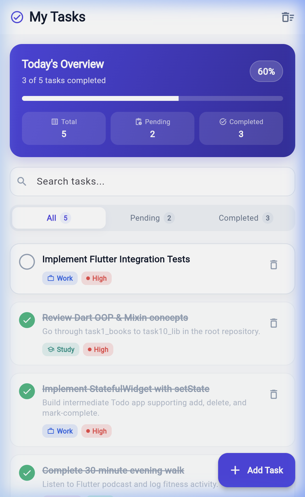
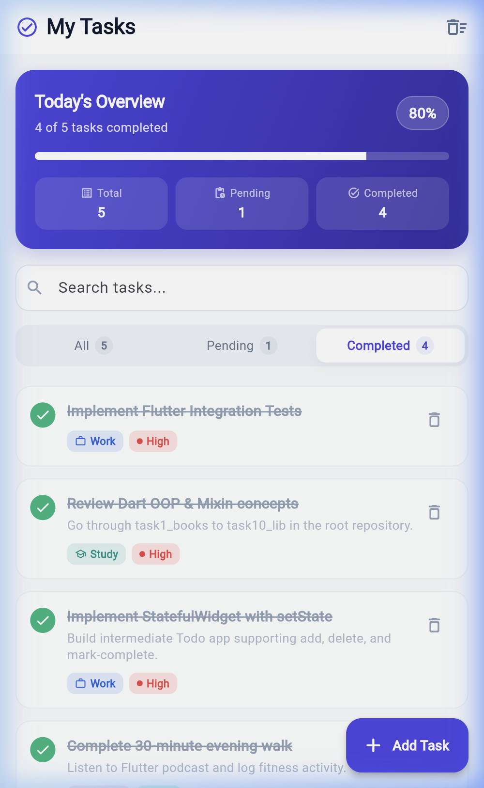
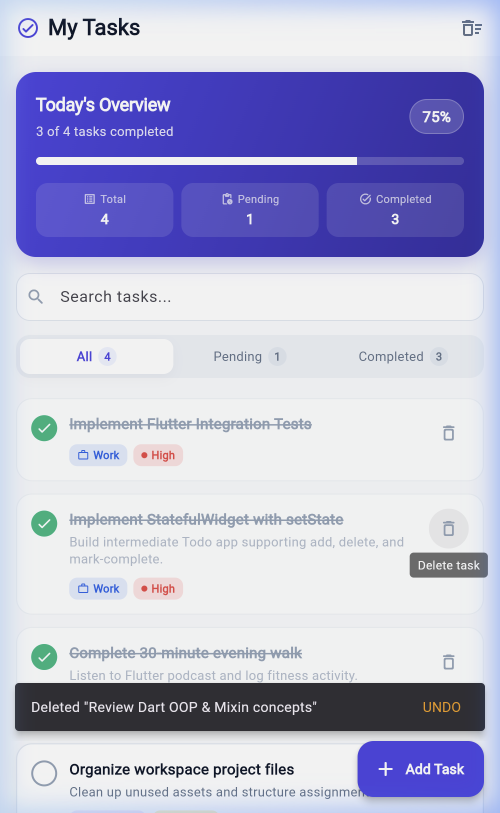

# 📝 FocusTrack — Intermediate Todo Application (Flutter StatefulWidget & setState)

**Author**: R Virshin Kumar (Reg: 150096724147)  
**Workspace**: `Cross-App / Assignments / todo_app`  
**Git Branch**: `assignment_5`  
**Framework**: Flutter SDK (Channel Stable 3.47.0, Dart 3.13.0)  

---

A modular, production-ready intermediate Flutter application demonstrating explicit state management using `StatefulWidget` and `setState`. The app supports **adding**, **deleting** (with undo), and **marking complete** operations, accompanied by real-time progress calculations, category badges, multi-criteria filtering, and sound null safety.

---

## 📸 Visual Gallery & Application Showcase

The following high-resolution screenshots demonstrate the core user workflows captured from the live application:

| 1. Overview & Stats Card | 2. Add Task Modal Sheet | 3. Mark Complete & Progress |
| :---: | :---: | :---: |
|  |  |  |
| *Gradient stats card with 25% progress & KPI badges* | *Bottom sheet modal with title validation & tags* | *Green checkmark, strikethrough & progress to 50%* |

| 4. Segmented Filter (Completed) | 5. Delete Task with UNDO SnackBar |
| :---: | :---: |
|  |  |
| *Filtering view rendering strictly completed tasks* | *Floating SnackBar with interactive Undo action* |

---

## 🚀 Key Features

- **Stateful State Management (`StatefulWidget` & `setState`)**:
  - Pure, predictable state updates without external state libraries.
  - Efficient Element-tree reconciliation using `ValueKey(task.id)`.
- **Full CRUD / Operational Support**:
  - ➕ **Add Task**: Sliding modal bottom sheet (`AddTaskSheet`) with title validation, optional description, category selector chips (`Study`, `Work`, `Personal`, `Health`), and priority levels (`Low`, `Medium`, `High`).
  - 🗑️ **Delete Task**: Trailing icon button or swipe-to-dismiss gesture (`Dismissible`) with instant `SnackBar` **Undo** capability restoring the task to its exact index.
  - ✅ **Mark Complete**: Interactive animated checkbox with reactive strikethrough styling (`TextDecoration.lineThrough`) and muted visual state.
  - 🧹 **Clear All Completed**: Batch purge action in the app bar with a safety confirmation dialog.
- **Analytics & Progress Overview**:
  - Dynamic `TodoStatsCard` displaying completion percentage, animated linear progress indicator, and total/pending/completed counters.
- **Dynamic Multi-Criteria Filtering & Search**:
  - Segmented filter bar (`All`, `Pending`, `Completed`) with live item count badges.
  - Real-time search query filtering across task titles and descriptions.
- **Curated Design Tokens (`AppPalette`)**:
  - Consistent color palette (Slate, Indigo, Emerald, Amber, Coral) matching repository standards (as seen in `dashboard/` and `profile/`).

---

## 📁 Project Structure

```
todo_app/
├── README.md                           # Public overview, screenshots & quickstart guide
├── DOCUMENTATION.md                    # Comprehensive 3+ page technical documentation
├── DOCUMENTATION.docx                  # Formatted Microsoft Word report with embedded visuals
├── pubspec.yaml                        # Flutter dependencies and configuration
├── screenshots/                        # High-resolution screenshots of all UI workflows
│   ├── 01_overview_screen.png
│   ├── 02_add_task_modal.png
│   ├── 03_task_completed.png
│   ├── 04_completed_filter.png
│   └── 05_delete_undo_snackbar.png
├── test/
│   └── widget_test.dart                # Automated tests for add, delete, toggle & filter
└── lib/
    ├── main.dart                       # App entrypoint & Material 3 ThemeData
    ├── constants/
    │   └── app_palette.dart            # Design tokens & color constants
    ├── models/
    │   └── todo_task.dart              # Domain model, TaskPriority, TaskCategory & TodoFilter enums
    ├── widgets/
    │   ├── add_task_sheet.dart         # Modal bottom sheet for creating tasks
    │   ├── category_filter_bar.dart    # Segmented filter bar with item counts
    │   ├── todo_item_tile.dart         # Task list tile with dismissible swipe & checkbox
    │   └── todo_stats_card.dart        # Completion progress & KPI stats card
    └── screens/
        └── todo_screen.dart            # Main StatefulWidget orchestrating application state
```

---

## 🛠️ Concepts Demonstrated (Mapping to Root Folder)

| Concept | Repository Reference | Implementation in `todo_app` |
| :--- | :--- | :--- |
| **Object-Oriented Programming** | `lib/task1_books.dart` - `task10_lib.dart` | `TodoTask` class with properties, named constructor, default values, `toggleCompleted()`, and `copyWith()`. |
| **List Operations** | `lib/task7_list.dart`, `dart_basics-main/2_collections.dart` | `List<TodoTask>` manipulation via `insert(0, ...)`, `removeAt()`, `removeWhere()`, `.where()`, and `.length`. |
| **Enums & Pattern Matching** | `dart_basics-main/7_advanced_control_flow.dart` | `TaskPriority`, `TaskCategory`, and `TodoFilter` enums with Dart 3 switch expressions for colors, icons, and filter conditions. |
| **Sound Null Safety** | `dart_basics-main/6_null_safety.dart`, `9_advanced_null_safety.dart` | Nullable `String? description`, safe Elvis operator `?.`, null coalescing `??`, and safe unwrapping. |
| **Stateful Management** | `first_ui/lib/main.dart`, `dashboard/lib/responsive_dashboard.dart` | `StatefulWidget` and explicit `setState(() { ... })` for immediate reactive updates. |
| **Interactive UX & Feedback** | `first_ui`, `dashboard` | `Dismissible` swipe-to-delete, floating `SnackBar` with interactive `SnackBarAction` for undo, and `showModalBottomSheet`. |

---

## 🧪 Verification & Automated Testing

### Static Analysis
```bash
flutter analyze
```
**Result**: `No issues found! (ran in 2.4s)` — 0 errors, 0 warnings.

### Automated Test Suite (`test/widget_test.dart`)
```bash
flutter test
```
**Results**:
- ✅ `TodoApp renders initial tasks and overview statistics`
- ✅ `Mark-complete operation toggles task completion state`
- ✅ `Add operation creates a new task via bottom sheet`
- ✅ `Delete operation removes a task and supports Undo`
- ✅ `Filter segment bar updates active tasks view`
- **Status: 5/5 tests passed.**

---

## ▶️ Getting Started & Execution

### Prerequisites
- Flutter SDK `^3.47.0`
- Dart SDK `^3.13.0`

### Running the Application

Navigate to the project directory and run on your preferred device:

```bash
cd /Users/virshin/VScode/Cross-App/Assignments/todo_app

# Run on Google Chrome
flutter run -d chrome

# Run on Android Emulator
flutter run -d emulator-5554

# Run on macOS Desktop
flutter run -d macos
```

*(You can also run directly from the workspace root via `cd /Users/virshin/VScode/Cross-App/todo_app && flutter run`)*
