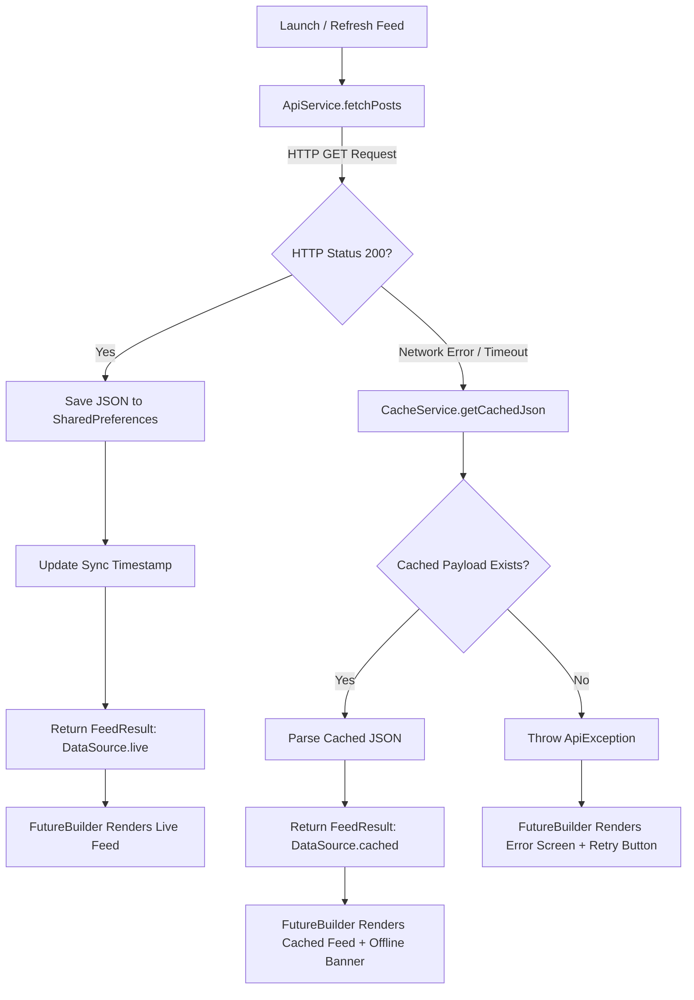

# PulseFeed — Engineering Intelligence Feed

PulseFeed is an offline-first mobile and desktop application developed with Flutter that fetches, displays, and caches engineering publications from a public REST API ([JSONPlaceholder](https://jsonplaceholder.typicode.com/posts)).

Built to demonstrate resilient asynchronous state management and local storage persistence, PulseFeed features seamless automatic offline fallback, dynamic keyword search filtering, animated loading skeletons, and interactive post inspection sheets.

---

## 🚀 Key Features

- **Asynchronous REST Fetching**: Consumes JSON publications via HTTP with custom timeouts and structured error handling.
- **Offline-First Persistence**: Caches raw API payloads in `SharedPreferences` upon every successful sync, recording timestamp metadata.
- **Graceful Network Fallback**: If an internet interruption or server outage occurs, PulseFeed automatically serves the last cached snapshot with an offline status banner rather than failing.
- **Declarative Asynchronous UI**: Employs Flutter's `FutureBuilder<FeedResult>` with explicit states for connection waiting, network error retry, and active content rendering.
- **Zero-Loop Future Management**: Eliminates standard `FutureBuilder` re-trigger anti-patterns by scoping futures to state lifecycles and explicit refresh triggers.
- **Interactive Search & Filtering**: Client-side query engine filters post titles and content in real-time.
- **Detailed Modal Inspector**: Bottom-sheet inspector providing reading time estimates, author metadata, category tagging, and formatted body text.
- **Cache Management**: User-controlled cache flushing and manual pull-to-refresh capabilities.

---

## 🏛️ Architecture & Project Structure

PulseFeed follows clean layered separation of concerns:

```
lib/
├── constants/
│   └── app_colors.dart         # Design tokens (Sapphire, Emerald, Amber, Slate)
├── models/
│   └── post_model.dart         # Entity model with JSON serialization & calculated fields
├── screens/
│   └── feed_screen.dart        # Feed UI with FutureBuilder, search, & bottom-sheet modal
├── services/
│   ├── api_service.dart        # Network client with automatic offline fallback logic
│   └── cache_service.dart      # SharedPreferences storage wrapper & timestamp tracking
├── widgets/
│   ├── post_card.dart          # Feed item card with reading time & tags
│   └── sync_status_bar.dart    # Live/Cached status banner with action buttons
└── main.dart                   # Application bootstrap with Material 3 theming
```

---

## 🔄 Caching & Data Flow Lifecycle



### FutureBuilder State Handling

`FeedScreen` handles all phases of the asynchronous lifecycle:
1. **Waiting (`ConnectionState.waiting`)**: Renders structured shimmer-like loading placeholder skeletons.
2. **Error (`snapshot.hasError`)**: Displays a clean error illustration, error description, and a 1-tap retry button.
3. **Data (`snapshot.hasData`)**:
   - Renders the `SyncStatusBar` indicating whether data is **Live** (green) or **Cached** (amber).
   - Renders a live keyword search field with clear action.
   - Shows empty search state if no articles match query.
   - Shows post cards with pull-to-refresh support.

---

## 🧪 Testing

PulseFeed includes unit and widget tests covering:
- JSON deserialization & serialization (`PostModel`)
- Local persistence & cache purging (`CacheService`)
- Mocked HTTP client live response handling (`ApiService`)
- Network failure offline fallback (`ApiService`)
- `FutureBuilder` rendering, search filtering, and bottom-sheet expansion (`FeedScreen`)

Run all tests:
```bash
flutter test
```

Run static analysis:
```bash
flutter analyze
```

---

## 🛠️ Getting Started

### Prerequisites
- Flutter SDK `^3.13.0` or later
- Android Studio / Xcode (or macOS desktop build tools)

### Installation
```bash
# Get dependencies
flutter pub get

# Run on available device or desktop
flutter run
```
