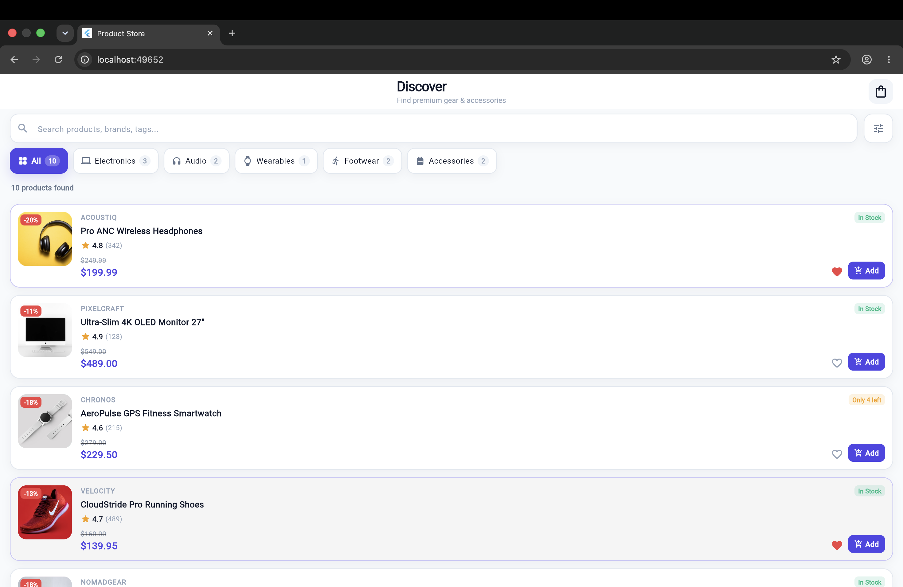
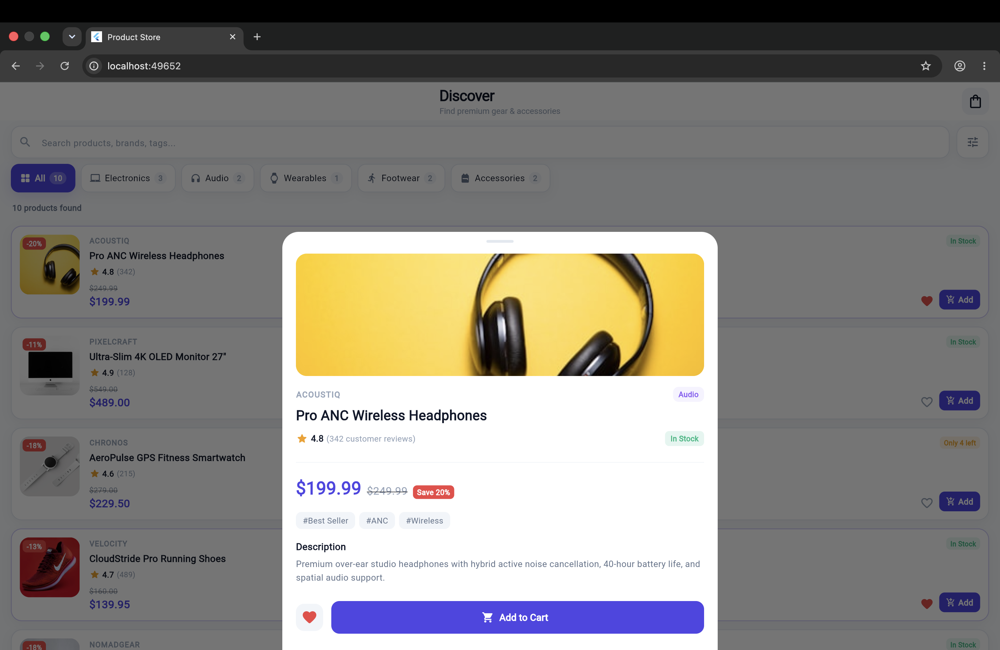
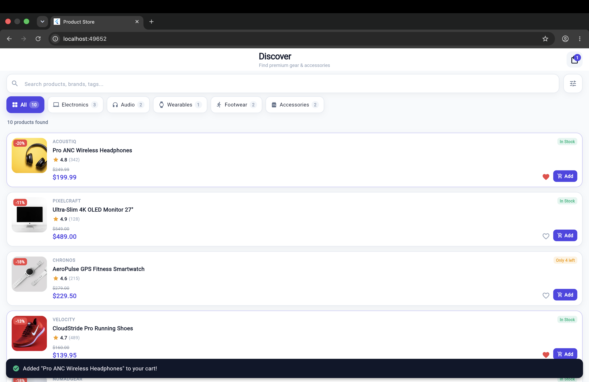
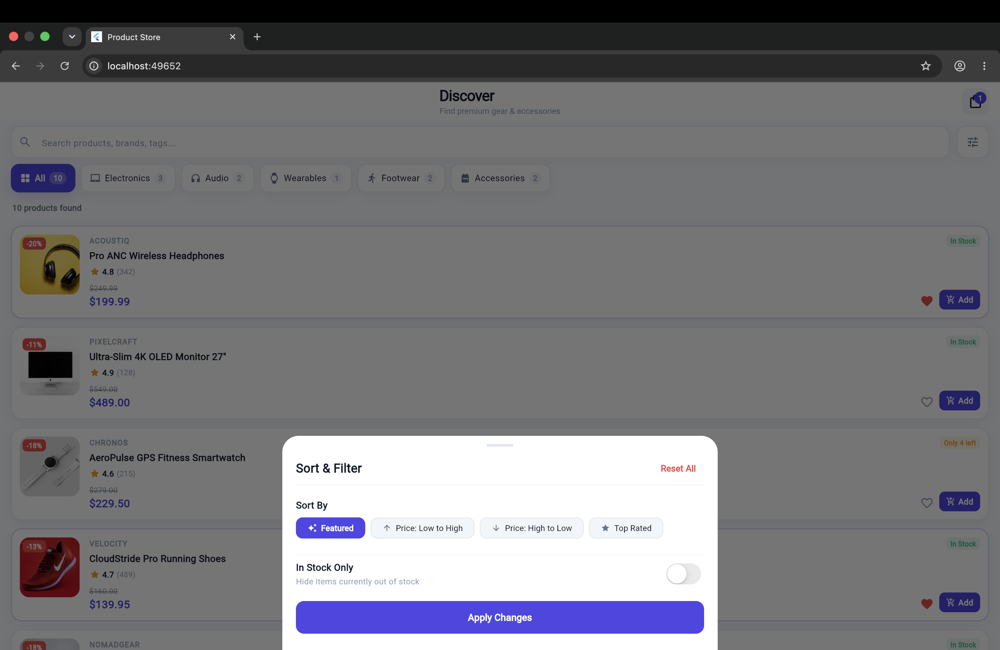
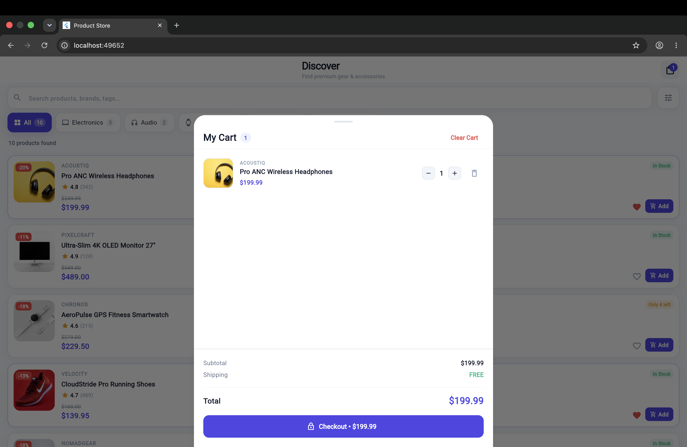

# 🛍️ Assignment 6 — Dynamic Product Listing with Search, Filter & Cart

**Author**: R Virshin Kumar  
**Registration Number**: 150096724147  
**Workspace**: `Cross-App / Assignments`  
**Git Branch**: `assignment_6`  
**Project Directory**: [`product_app/`](product_app/)  
**Framework**: Flutter SDK (Channel Stable 3.47.0, Dart 3.13.0)  

---

## 📌 Project Overview

This repository branch houses **Assignment 6**, featuring an intermediate-level e-commerce catalog application (**ProductStore**) built with core Flutter SDK widgets and Dart 3. The project demonstrates list virtualization using `ListView.builder`, robust null-safe domain modeling (`Product`, `CartItem`), and multi-criteria reactive search and filtering functionality managed via `setState()`.

---

## 📄 Documentation Deliverables

- **PDF Documentation**: [`DOCUMENTATION.pdf`](DOCUMENTATION.pdf) or [`product_app/DOCUMENTATION.pdf`](product_app/DOCUMENTATION.pdf) (12 pages, publication-grade layout with embedded high-resolution screenshots, complete visual audit, and 2,500+ words of technical analysis).
- **Microsoft Word Documentation**: [`DOCUMENTATION.docx`](DOCUMENTATION.docx) or [`product_app/DOCUMENTATION.docx`](product_app/DOCUMENTATION.docx) (Formatted report with tables, callouts, and embedded graphics).
- **Markdown Documentation**: [`DOCUMENTATION.md`](DOCUMENTATION.md) or [`product_app/DOCUMENTATION.md`](product_app/DOCUMENTATION.md) (Comprehensive technical architecture specification).
- **Project README**: [`product_app/README.md`](product_app/README.md) (Detailed feature breakdown, testing matrix, and local execution instructions).

---

## 📸 Visual Showcase & Workflow Walkthrough

| Screen 1: Primary Catalog Overview | Screen 2: Product Detail Modal |
|:---:|:---:|
|  |  |
| *Virtualized ListView.builder with network imagery, category pills & badges* | *Modal bottom sheet with hero photo, specs, tags, and Add to Cart CTA* |

| Screen 3: Reactive Cart Feedback | Screen 4: Sort & Filter Modal |
|:---:|:---:|
|  |  |
| *Floating SnackBar with VIEW CART action and reactive badge counter* | *Sorting criteria radio chips & adaptive In Stock Only toggle switch* |

| Screen 5: Interactive Shopping Cart Sheet |
|:---:|
|  |
| *Full slide-up CartSheet with quantity steppers, subtotal breakdown, and checkout CTA* |

---

## 🚀 Key Implementation Highlights

1. **Dynamic List Virtualization (`ListView.builder`)**:
   - Memory-efficient on-demand tile instantiation and element recycling.
   - Stable identity preservation using `ValueKey(product.id)`.

2. **Domain Data Models**:
   - [`Product`](product_app/lib/models/product.dart): Complete OOP entity with Dart 3 pattern matching, computed financial metrics (`formattedPrice`, `discountPercentage`, `hasDiscount`), stock badges, and `copyWith()` support.
   - [`CartItem`](product_app/lib/models/cart_item.dart): Line-item model with dynamic quantity and subtotal calculations.

3. **Reactive Multi-Criteria Filtering (`setState`)**:
   - Real-time search query matching across names, brands, descriptions, and tags.
   - Horizontal category selector with dynamic count badges.
   - Sort & filter bottom modal sheet (Featured, Price Low/High, Rating, In-Stock Only).
   - Empty state fallback with query echo and one-tap reset button.

4. **Shopping Cart Sheet (`CartSheet`)**:
   - Slide-up modal displaying itemized products with photo thumbnails.
   - Quantity stepper controls (`+` / `-`), line-item deletion, subtotal, free shipping, and checkout CTA.

5. **Curated Design Tokens (`AppPalette`)**:
   - Seamless design alignment with previous workspace projects (`dashboard/`, `todo_app/`).

---

## 🧪 Quick Test & Run

```bash
cd product_app

# Run automated tests (6 passed)
flutter test

# Run static analysis (0 issues)
dart analyze

# Run on Chrome
flutter run -d chrome
```

